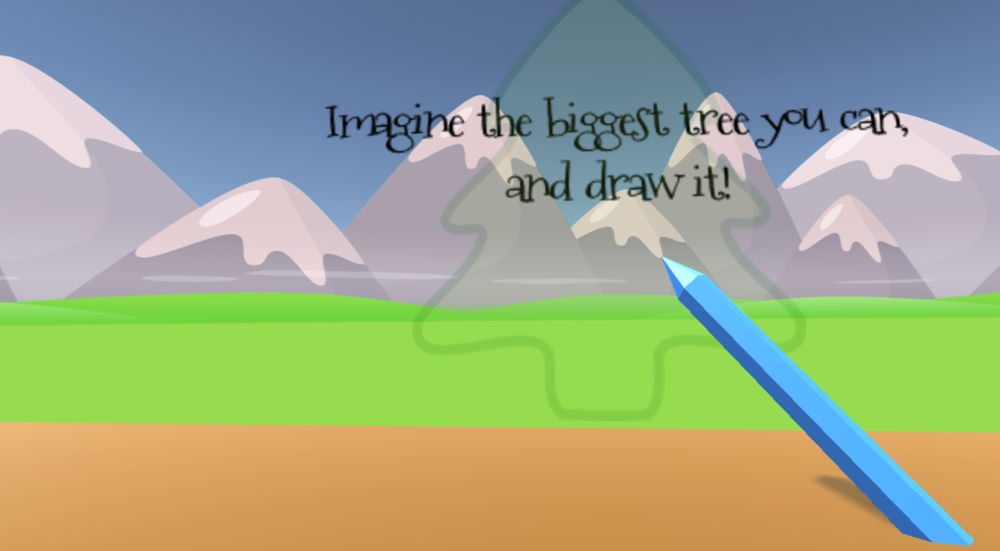
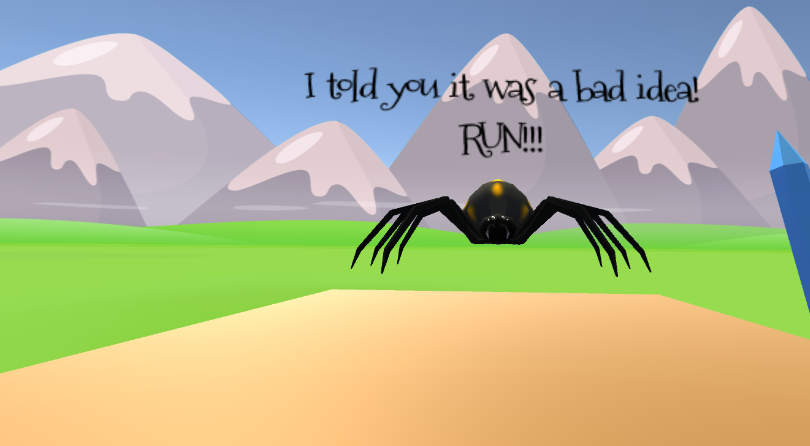

# Henry and the Blue Pencil (Virtual Reality Game)

Henry goes on an adventure with his magic blue pencil, drawing whatever he wants into reality! But will he return safely home before his mother returns?

**Controls for Oculus Touch**

- Left stick - Movement of character
- Right stick - Rotation of body
- Right trigger - Draw using your pencil!

**Gameplay**

 

The game includes a short adventure where you play as the child protagonist, Henry. You are guided from the beginning to start tracing glowing outlines to exit your bedroom and eventually create trees, cars, and more!

*Henry and the Blue Pencil* boasts a fun twist at the end.

**Inspiration**

This project was originally created during University as a final project, and was inspired by one of my favorite childhood books [*Harold and the Purple Crayon*](https://en.wikipedia.org/wiki/Harold_and_the_Purple_Crayon) (which was eventually adapted into a [TV series](https://www.imdb.com/title/tt0283735/) and a [film](https://www.imdb.com/title/tt1219760/)).

I loved the creativity of being able to draw abstractly in the two dimensional space, and have the three dimensional counterparts "magically" come to life. Therefore, to avoiding copyright infringement, *Henry and the Blue Pencil* was born!

**Tips**

- If you can't see a pencil in your right hand, ensure your Touch controllers are on and connected
- Only draw when the pencil is physically touching an outline, and don't release until you are done tracing!
